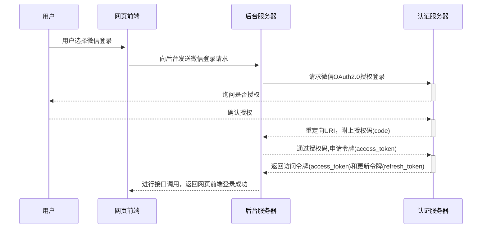

# 微信第三方登录

### OAouth2.0中协议的授权码模式

```mermaid
	sequenceDiagram
	用户->>+网页前端:用户选择微信登录
	网页前端 ->>+后台服务器: 向后台发送微信登录请求
	后台服务器->>+认证服务器:请求微信OAuth2.0授权登录
	认证服务器-->>-用户:询问是否授权
	用户-->>+认证服务器:确认授权
	认证服务器-->>-后台服务器:重定向URI，附上授权码(code)
	后台服务器-->>+认证服务器:通过授权码,申请令牌(access_token)
	认证服务器-->>-后台服务器:返回访问令牌(access_token)和更新令牌(refresh_token)
	后台服务器-->>网页前端:进行接口调用，返回网页前端登录成功
```
