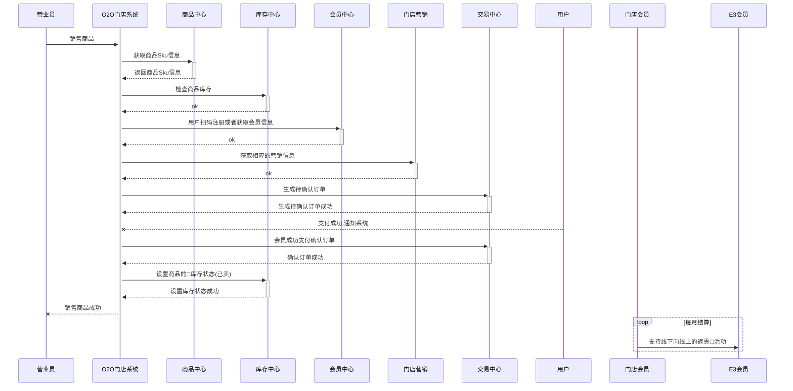
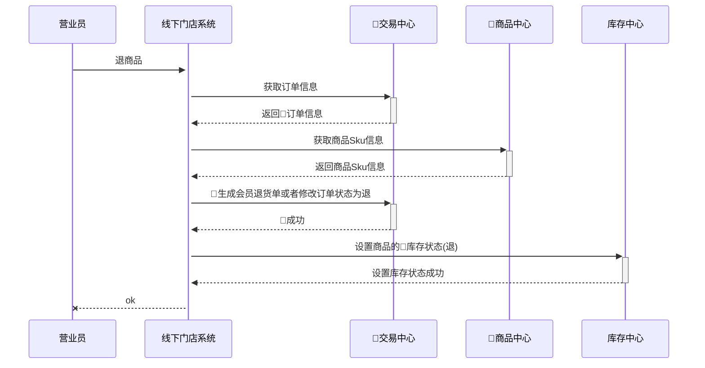
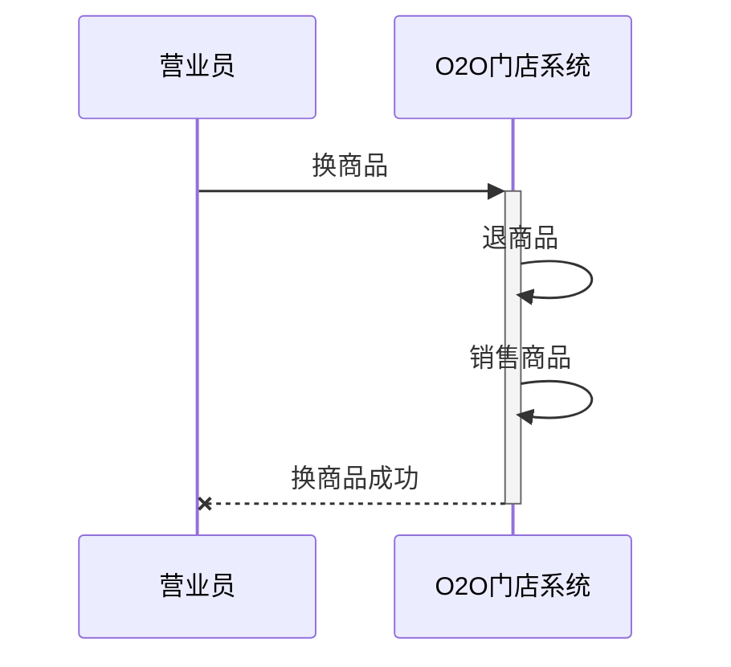
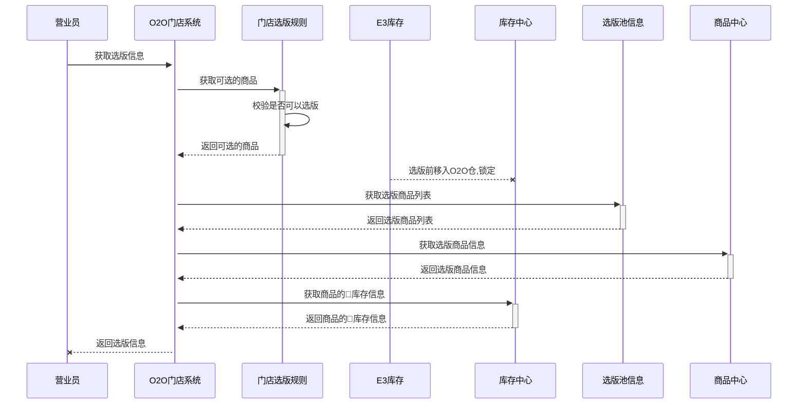
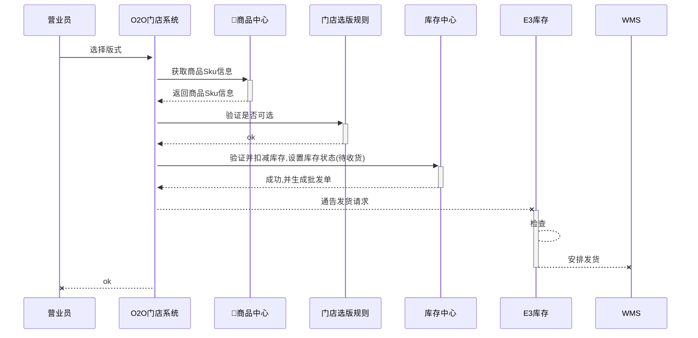
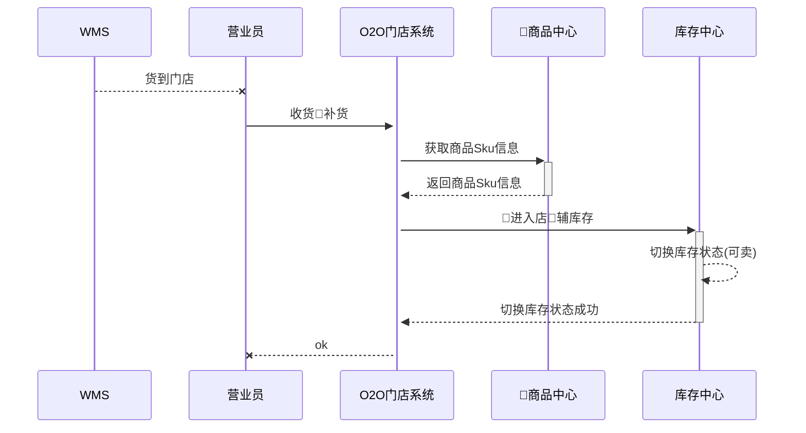
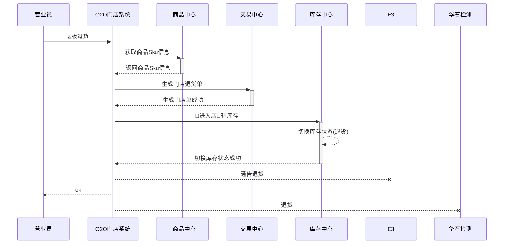

# 基于服务中台的业务时序图

> from: aliware架构师-程咬金

## 售卖服务

### 1. 售卖商品流程

```mermaid
   	sequenceDiagram
    营业员 ->>+O2O门店系统: 销售商品    
    O2O门店系统 ->>+ 商品中心: 获取商品Sku信息
    商品中心 -->> -O2O门店系统: 返回商品Sku信息
    O2O门店系统 ->> +库存中心: 检查商品库存
    库存中心 -->> -O2O门店系统: ok
    O2O门店系统 ->>+ 会员中心: 用户扫码注册或者获取会员信息
    会员中心 -->> -O2O门店系统: ok
    O2O门店系统 ->>+ 门店营销: 获取相应的营销信息
    门店营销 -->> -O2O门店系统: ok    
    O2O门店系统 ->> + 交易中心: 生成待确认订单
    交易中心 -->> -O2O门店系统: 生成待确认订单成功
    用户 --x O2O门店系统: 支付成功,通知系统
    O2O门店系统 ->> + 交易中心: 会员成功支付确认订单
    交易中心 -->> -O2O门店系统: 确认订单成功
    O2O门店系统 ->> +库存中心: 设置商品的库存状态(已卖)
    库存中心 -->> -O2O门店系统: 设置库存状态成功
    O2O门店系统 --x 营业员: 销售商品成功
    loop 每月结算
    门店会员 ->> E3会员: 支持线下向线上的返惠活动
    end
```

### 2. 退货流程

```mermaid
      sequenceDiagram
      营业员 ->>+线下门店系统: 退商品
      线下门店系统 ->> +交易中心: 获取订单信息
      交易中心 -->> -线下门店系统: 返回订单信息
      线下门店系统 ->> +商品中心: 获取商品Sku信息
      商品中心 -->> -线下门店系统: 返回商品Sku信息
      线下门店系统 ->> +交易中心: 生成会员退货单或者修改订单状态为退
      交易中心 -->> -线下门店系统: 成功
      线下门店系统 ->> +库存中心: 设置商品的库存状态(退)
      库存中心 -->> -线下门店系统: 设置库存状态成功
      线下门店系统 --x 营业员: ok
```

### 3. 换货流程

```mermaid
      sequenceDiagram
      营业员 ->>+O2O门店系统: 换商品
      O2O门店系统 ->> O2O门店系统: 退商品
      O2O门店系统 ->> O2O门店系统: 销售商品
      O2O门店系统 --x -营业员: 换商品成功
```

## 选版服务

### 1. 获取选版信息

```mermaid
    sequenceDiagram
    营业员 ->>+O2O门店系统: 获取选版信息;
    O2O门店系统 ->> +门店选版规则: 获取可选的商品;
    门店选版规则 ->> 门店选版规则: 校验是否可以选版;
    门店选版规则 -->> -O2O门店系统: 返回可选的商品;
    E3库存 --x 库存中心: 选版前移入O2O仓,锁定
    O2O门店系统 ->>+ 选版池信息: 获取选版商品列表;
    选版池信息 -->>- O2O门店系统: 返回选版商品列表;
    O2O门店系统 ->>+ 商品中心: 获取选版商品信息;
    商品中心 -->>- O2O门店系统: 返回选版商品信息;
    O2O门店系统 ->> +库存中心: 获取商品的库存信息;
    库存中心 -->> -O2O门店系统: 返回商品的库存信息;
    O2O门店系统 --x 营业员: 返回选版信息;
```

### 2. 选择版式

```mermaid
    sequenceDiagram;
    营业员 ->>+O2O门店系统: 选择版式;
    O2O门店系统 ->> +商品中心: 获取商品Sku信息;
    商品中心 -->> -O2O门店系统: 返回商品Sku信息;
    O2O门店系统 ->> +门店选版规则: 验证是否可选;
    门店选版规则 -->> -O2O门店系统: ok;    
    O2O门店系统 ->> +库存中心: 验证并扣减库存,设置库存状态(待收货);
    库存中心 -->> -O2O门店系统: 成功,并生成批发单; 
    O2O门店系统 --x+ E3库存: 通告发货请求;
    E3库存 --> E3库存: 检查
    E3库存 --x- WMS: 安排发货;
    O2O门店系统 --x 营业员: ok;
```

### 3. 收版

```mermaid
      sequenceDiagram;
      WMS --x 营业员: 货到门店;
      营业员 ->>+O2O门店系统: 收货补货;
      O2O门店系统 ->> +商品中心: 获取商品Sku信息;
      商品中心 -->> -O2O门店系统: 返回商品Sku信息;
      O2O门店系统 ->> +库存中心: 进入店辅库存;
      库存中心 -->> 库存中心: 切换库存状态(可卖);
      库存中心 -->> -O2O门店系统: 切换库存状态成功;
      O2O门店系统 --x 营业员: ok;
```

### 4. 退版

```mermaid
      sequenceDiagram;
      营业员 ->>+O2O门店系统: 退版退货;
      O2O门店系统 ->> +商品中心: 获取商品Sku信息;
      商品中心 -->> -O2O门店系统: 返回商品Sku信息;
      O2O门店系统 ->> +交易中心: 生成门店退货单;
      交易中心 -->> -O2O门店系统: 生成门店单成功;
      O2O门店系统 ->> +库存中心: 进入店辅库存;
      库存中心 -->> 库存中心: 切换库存状态(退货);
      库存中心 -->> -O2O门店系统: 切换库存状态成功;
      O2O门店系统 --x E3: 通告退货;
      O2O门店系统 --x 营业员: ok;
      O2O门店系统 --x 华石检测: 退货;
```
